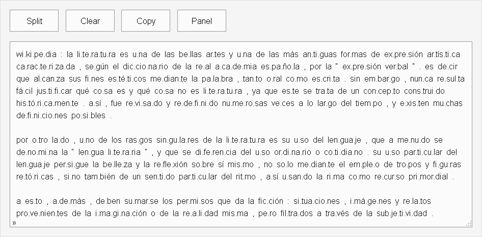
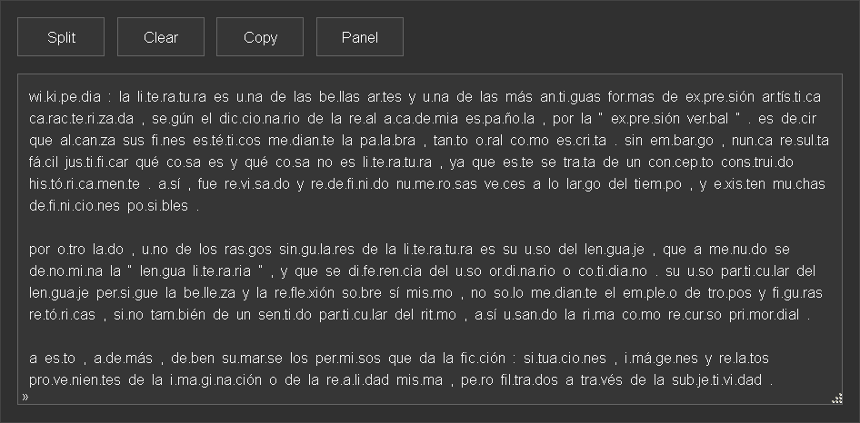

# Syllable Separator

A simple syllable separator for text in Spanish ( ideal for learning or teaching Spanish )

## Screenshots





## Description

The script separates into syllables the words that contain the letters: aeiou áéíóúü bcdfghjklmnñpqrstvwxyz.

Except for the following exceptions:<br>
&#8226; Words ( non-native or special ) that begin with . ( dot ) For example: .beatles, .jeans, etc.<br>
&#8226; Words containing the special characters ( # @ ) For example: #tarde, no@che, etc.<br>
&#8226; Words enclosed in braces { ... } For example: a.que.lla&nbsp;&nbsp;fru.ta&nbsp;&nbsp;{ roja y madura }

The script processes words that are partially separated into syllables. For example: sub-lunar, to sub.lu.nar

The script also contains a dictionary of words that do not follow the general rules. For example: fluía, to flu.í.a<br>
There are several words that do not follow these rules, so the content of this dictionary will expand over time.

## Installation

```bash
npm i syllable-separator
```

## Usage

```js
let text = 'Lo que sabemos es una gota y lo que ignoramos es un océano';
let syllable = require('syllable-separator');
let splittext = syllable.Separator(text);

console.log(splittext);

// lo  que  sa.be.mos  es  u.na  go.ta  y  lo  que  ig.no.ra.mos  es  un  o.cé.a.no
```

## Test

```bash
npm test
```

## Demo

[HOME](https://harmotus.github.io/syllable-separator)

## License

[MIT](https://opensource.org/license/mit)
